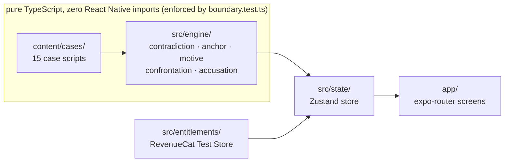

# Private Texts

A murder mystery told entirely through text threads. You have the victim's
phone. You win only by pinning two messages that can't both be true, and
proving it.

No dialogue trees, no inventory, no gut-feeling "who did it" button. The
accusation screen is gated by a rules engine that checks your evidence, not
your vibes.

Built for the **RevenueCat Shipaton 2026, Next Gen award**.

<!--
  PLACEHOLDER: animated GIF of the COMPARE interaction (~10s loop).
  Pin two claims on the evidence board, tap COMPARE, watch the connector line
  and the revelation type out. Task 18 in HANDOFF.md. Not recorded yet.
-->
> `[ GIF: the COMPARE interaction (not recorded yet) ]`

---

## What makes it different

Most mystery games script the "aha" moment: tap the right dialogue option,
watch a cutscene. Here the aha moment is computed. Every message that matters
emits a typed **claim** ("Nadia was at the studio, 21:40-22:20"), and a pure
function decides whether any two claims can both be true:

```ts
// src/engine/contradiction.ts
checkContradiction(ctx, claimA, claimB)
// → { ok: true,  reason: "One person, two places, same moment." }
// → { ok: false, reason: "These describe different times." }
// → { ok: false, reason: "These are about different people." }
```

When a player pins the wrong pair, the game says why: different people,
different times, same area under a different name. A wrong guess becomes a
lesson instead of a dead end. It's also the clearest evidence on screen that
a real engine is judging the pairing, because the explanation changes with
the claims, not with a script.

There's a story-level layer on top of the mechanical one, too. A background
figure phones the killer in every one of the 15 cases. He only ever
telephones, about ninety seconds a call, so no case file contains a single
word he wrote. The only trace he leaves is a habit: an odd follow-up
question, a phrase only one profession uses, that surfaces in the
confrontation. He has told the truth on every call. Except once, in Pack 1.

## Architecture

`src/engine/` is pure TypeScript. It imports nothing from React Native, Expo,
or React, which is what lets the whole rules layer run as a plain Node test
suite in milliseconds instead of a simulator. The boundary isn't a comment or
a convention; `src/engine/boundary.test.ts` reads every source file under
`src/engine/` and `content/` and fails the build if any of them import a
native module.



`content/` holds data, never logic. A case script is validated at import time
by `loadCase()` (Zod schema plus a manual referential-integrity pass), so a
broken case fails at startup with a specific error instead of failing a
player mid-story. `app/` is thin routing over the store; it does not decide
whether anything contradicts anything.

The accusation screen checks proof before identity: `evaluateAccusation`
first counts how many of the case's required contradictions are confirmed,
and only names a suspect right or wrong once that count is complete.
Otherwise a player could brute-force the killer by tapping every suspect in
turn.

## The fifteen cases

15 cases, 769 messages, roughly 19,800 words in the messages alone, before
briefings and confessions. Each case ships with its own test file; a shared
contract in `content/cases/caseContract.ts` runs an exhaustive pairwise scan
of every claim in every case and fails if two claims contradict without the
author declaring it. `docs/pack-ledger.md` is the uniqueness contract behind
them: no two packs share the same shape of lie, and it's checked mechanically
in `content/cases/ledger.test.ts`.

Packs 1–3 are free. The rest unlock through the RevenueCat entitlement below.

| # | Title | Hook |
|---|---|---|
| 1 | The Lighthouse `FREE` | Your aunt kept the light at Ardnoe Point. They're calling it a fall. You have her phone, and everyone still has their story straight. |
| 2 | The Understudy `FREE` | A lead actress dies in a locked dressing room on press night. One key exists, and two people say they had it. |
| 3 | The Night Round `FREE` | A signature in the night book says somebody looked in on her at eleven. Nobody did. |
| 4 | Deep Field | Six people, four months of darkness, and nobody can leave. The alibi is a timestamp, and the timestamp is in the wrong clock. |
| 5 | The Wake | Forty-one people were in the house and they all tell the same story, word for word. It was built to protect somebody who did not do it. |
| 6 | The Long Course | Eight people in the same kit, on the water, for twenty-two minutes. The photographs prove eight were in that boat. They cannot prove which eight. |
| 7 | The Bothy | Five people walked out of a whiteout into one room, hours apart. They agree on everything except the order. |
| 8 | Sunday Service | The register says there was a wedding that August. The man who reroofed the church says there was no roof on it. |
| 9 | The Cut | A narrowboat does three miles an hour, and everybody on the cut can do that arithmetic. Nobody thought to ask whether he took the boat. |
| 10 | Open Mic | His alibi is on video. Same shirt, same five minutes, same laugh in the same place. It's from the Tuesday before. |
| 11 | The Allotments | Everybody on that site knows whose fork it is. Nobody asked whose shed it had been in for ten days. |
| 12 | The Helpline | Every call is logged by hand and nobody has ever had a reason to check one. His alibi is ninety minutes on a line that was never in use. |
| 13 | The Reunion | Ninety people can tell you who they were standing with. Not one of them can tell you what time it was. |
| 14 | The Night Ferry | He can tell you exactly what he did while the ship was alongside at Kirkwall. The ship never called at Kirkwall. |
| 15 | The Listener | He has told you the truth for fifteen cases. He lied exactly once, to somebody else, and you wrote it down without knowing what it was. |

Every case is written out in full, as delivered in-game, in
[`docs/storybook.md`](docs/storybook.md), the fastest way to read the content
without installing anything.

## RevenueCat integration

The game is free through Pack 3. Packs 4–15 unlock through one non-consumable
entitlement, sold through RevenueCat's **Test Store**, which runs a real
purchase flow with no paid Apple or Google developer account. That's what
makes the Next Gen category reachable without a store listing.

- `src/entitlements/revenuecat.ts`: configure, fetch the offering, purchase,
  restore. Purchase outcomes are a discriminated union
  (`purchased` / `cancelled` / `failed`) rather than a boolean, so a
  cancelled sheet is never confused with a failed transaction in the UI.
- `src/entitlements/ids.ts`: the entitlement identifier, `case_pack_1`, kept
  in its own zero-import module so case content can reference it without
  pulling `react-native-purchases` into the engine's test suite.
- `src/entitlements/keyPolicy.ts`: decides whether the SDK gets configured at
  all. A Test Store key only works in a Debug build. This module keeps that
  key from ever reaching a Release build, where the SDK would otherwise show
  a "Wrong API Key" alert and terminate the app.
- `src/entitlements/diagnosis.ts`: reads a customer's full entitlement record
  and states in plain language why a purchase did or didn't unlock content,
  for the case where the receipt is valid but nothing changed.

**For judges:** no payment method or developer account is needed to see the
paid content. On the paywall, completing the Test Store purchase sheet
unlocks Packs 4–15 immediately.

## Running it

```bash
git clone https://github.com/armaanawesome/private-texts.git
cd private-texts
npm install
cp .env.example .env
```

Get a free RevenueCat Test Store key at app.revenuecat.com → **Apps and
providers → Test Store**, and put it in `.env` as
`EXPO_PUBLIC_RC_TEST_STORE_KEY`. The app runs with purchases disabled if you
skip this step; everything else still works.

```bash
npm test          # engine, state, entitlements, content: plain Node, no simulator
npx tsc --noEmit   # typecheck
```

To run the app itself, this project builds on EAS rather than a local
Android SDK or Xcode. Two build profiles do two different jobs:

| Profile | Build type | What it's for |
|---|---|---|
| `preview` | Release | Play the game. Installs standalone, no Metro needed. Purchases are off; a Test Store key cannot run in a Release build. |
| `development` | Debug | Demo a real purchase. Needs Metro running (`expo start --dev-client`). |

```bash
npx eas-cli build --profile preview --platform android
```

See [`docs/BUILDING.md`](docs/BUILDING.md) for the full build pipeline,
including why those two profiles exist and the failure mode they were built
to avoid.

## Testing

```
npm test
 Test Files  34 passed (34)
      Tests  595 passed (595)
```

Coverage on the engine and state layers (`src/engine/`, `src/state/`) is
93.8% statements / 90.2% branches. Every case pack, the contradiction
validator, the accusation gate, and the entitlement key policy each have
their own test file; the full list is under `src/engine/*.test.ts`,
`src/entitlements/*.test.ts`, and `content/cases/*.test.ts`.

## Build

<!-- PLACEHOLDER: Codemagic release APK link (Task 19 in HANDOFF.md). Not built yet, EAS-only for now. -->
`[ Downloadable APK: not yet built. See docs/BUILDING.md for EAS instructions in the meantime. ]`

## Screenshots

<!-- PLACEHOLDER: 5 screenshots at 1179×2556, no device frame (Devpost requirement). Not captured yet. -->
`[ Screenshots: not captured yet ]`

## Tech stack

Expo SDK 57 · React Native 0.86 · React 19 · TypeScript 6 (strict,
`noUncheckedIndexedAccess`) · expo-router · Zustand · Zod ·
react-native-reanimated 4 · react-native-purchases · Vitest.

## License

[MIT](LICENSE)
